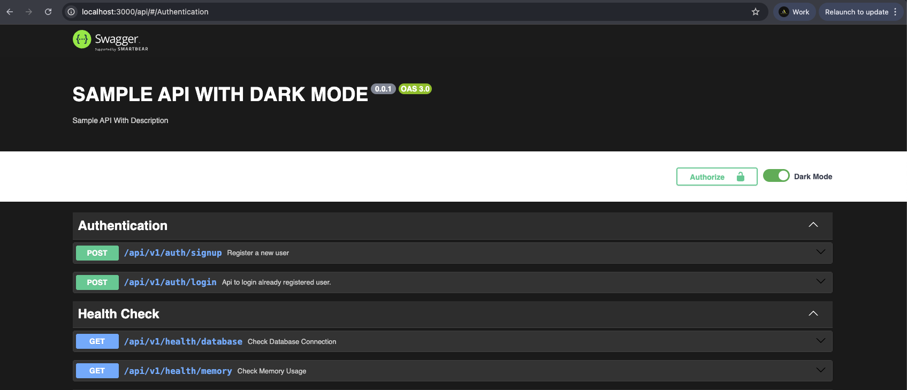
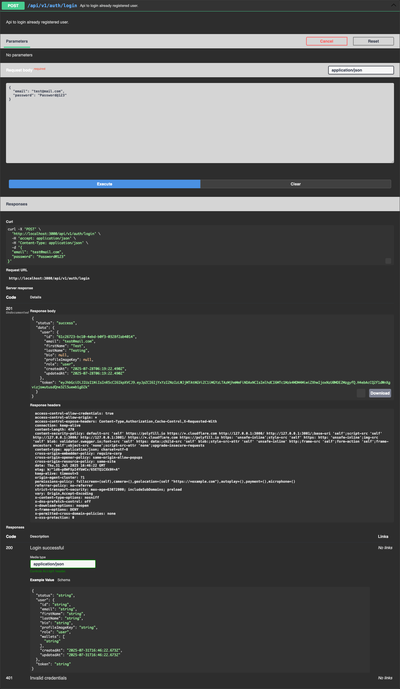

# Swagger Dark Mode

A simple middleware that adds dark mode functionality to Swagger UI with a toggle switch.

## Installation

```bash
npm install @debiprasadmishra50/swagger-dark-mode
```

## Usage

### Express.js

```typescript
import express from "express";
import swaggerUi from "swagger-ui-express";
import { swaggerDarkModeMiddleware, SWAGGER_CUSTOM_CSS } from "@debiprasadmishra50/swagger-dark-mode";

const app = express();

// Apply the dark mode middleware
app.use("/api", swaggerDarkModeMiddleware);

// Setup Swagger UI with custom CSS
app.use(
  "/api",
  swaggerUi.serve,
  swaggerUi.setup(swaggerDocument, {
    customCss: SWAGGER_CUSTOM_CSS,
  })
);
```

### JavaScript (CommonJS)

```javascript
const express = require("express");
const swaggerUi = require("swagger-ui-express");
const { swaggerDarkModeMiddleware, SWAGGER_CUSTOM_CSS } = require("@debiprasadmishra50/swagger-dark-mode");

const app = express();

app.use("/api", swaggerDarkModeMiddleware);
app.use(
  "/api",
  swaggerUi.serve,
  swaggerUi.setup(swaggerDocument, {
    customCss: SWAGGER_CUSTOM_CSS,
  })
);
```

### NestJS

```typescript
import { NestFactory } from "@nestjs/core";
import { SwaggerModule, DocumentBuilder } from "@nestjs/swagger";
// import the middlewares
import { swaggerDarkModeMiddleware, SWAGGER_CUSTOM_CSS } from "@debiprasadmishra50/swagger-dark-mode";

async function bootstrap() {
  const app = await NestFactory.create(AppModule);

  // Apply dark mode middleware
  app.use("/api", swaggerDarkModeMiddleware);

  const config = new DocumentBuilder()
    .setTitle("Your API")
    .setDescription("API description")
    .setVersion("1.0")
    .build();

  const document = SwaggerModule.createDocument(app, config, { ignoreGlobalPrefix: false });
  SwaggerModule.setup("api", app, document, {
    swaggerOptions: {
      tagsSorter: "alpha",
      docExpansion: "none",
    },
    // Apply the custom CSS
    customCss: SWAGGER_CUSTOM_CSS,
  });

  await app.listen(3000);
}
```

## Features

- 🌙 **Dark Mode Toggle**: Adds a toggle switch to Swagger UI
- 💾 **Persistent Settings**: Remembers user preference in localStorage
- 🎨 **Complete Styling**: Dark theme for all Swagger UI components
- ⚡ **Easy Integration**: Simple middleware for any Express-based app
- 🔧 **TypeScript Support**: Full TypeScript definitions included

## API

### `swaggerDarkModeMiddleware`

Express middleware that injects dark mode toggle into Swagger UI pages.

### `SWAGGER_CUSTOM_CSS`

CSS string containing dark mode styles for Swagger UI.

## Examples

### Nest JS Example



### Nest JS Request Example



### Express JS Example


## License

MIT
